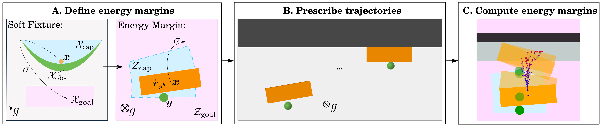

# EnergyMarginDynCage
Code for RAL paper - Characterizing Robustness in Manipulation through Energy Margin and Dynamic Caging Analysis

The paper can be found here - https://arxiv.org/abs/2404.12115

Briefly speaking, inspired by prior work on caging and soft fixtures, we propose a way to characterize the robustness of dynamic manipulation scenarios using energy margins from failure (A). Energy margins serve as metrics for predicting manipulation robustness and success under uncertainty. Given prescribed trajectories of manipulation tasks (B, planar pushing as an example in the illustration), we employ sampling-based kinodynamic planners to compute the metrics (C).

The code will be updated and organized soon.